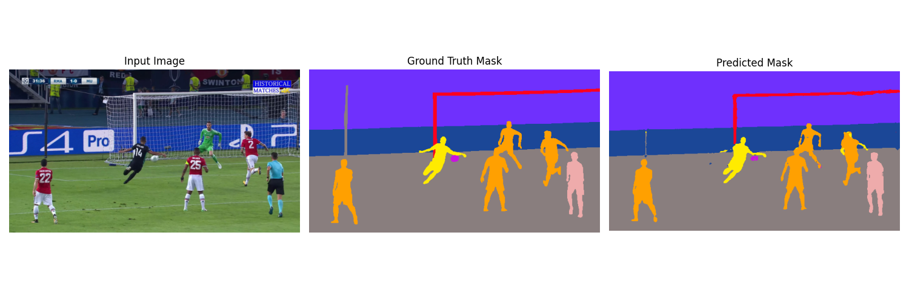

# Semantic Segmentation

Creating a Semantic Segmentation Model trained using a UNet Model with Skip Connections which can be trained on any model with any number of classes.

---

### 1. What it contains

**a.** <u>**Model.ipynb**</u> - it contains the training loop and associated code for presenting and saving results.

**b.** <u>**utils.py**</u> - it contains the definition for all the classes and helper function.

**c.** <u>**determinemasks.py**</u> - it contains functionality for determining the number of masks and the associated unique colors, if unknown. It helps preparing the dataset for the Multi-Class Segmentation.

---
### 2. An Example

The image on the right shows what my implementation learned after **50** epochs training with a **0.80-0.10-0.20** split of the dataset.

---

📧 If you have any recommendations for this repo or any of my works in general you can reach out to me on my [gmail](mailto:vanshwhig24@gmail.com)

Here is the [MIT License](LICENSE)
